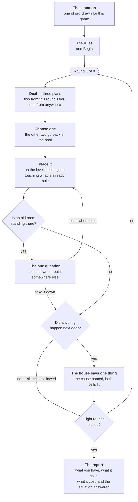
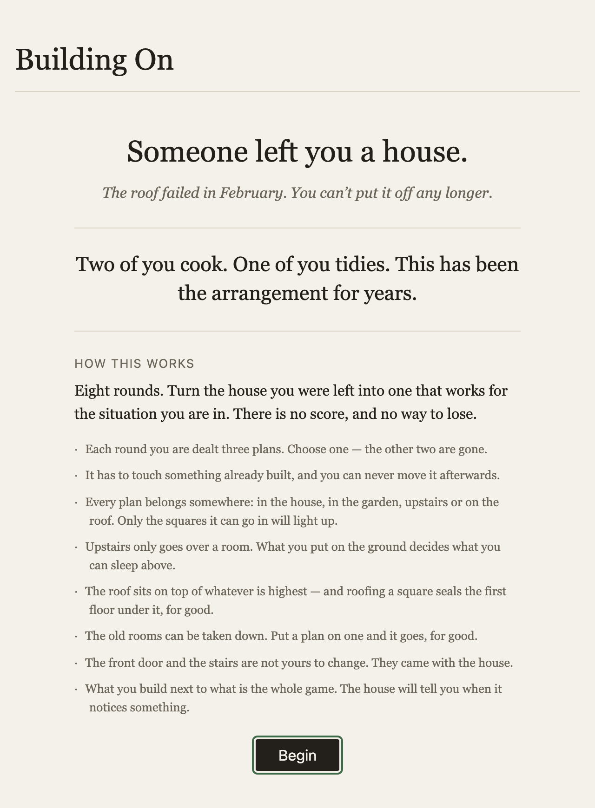
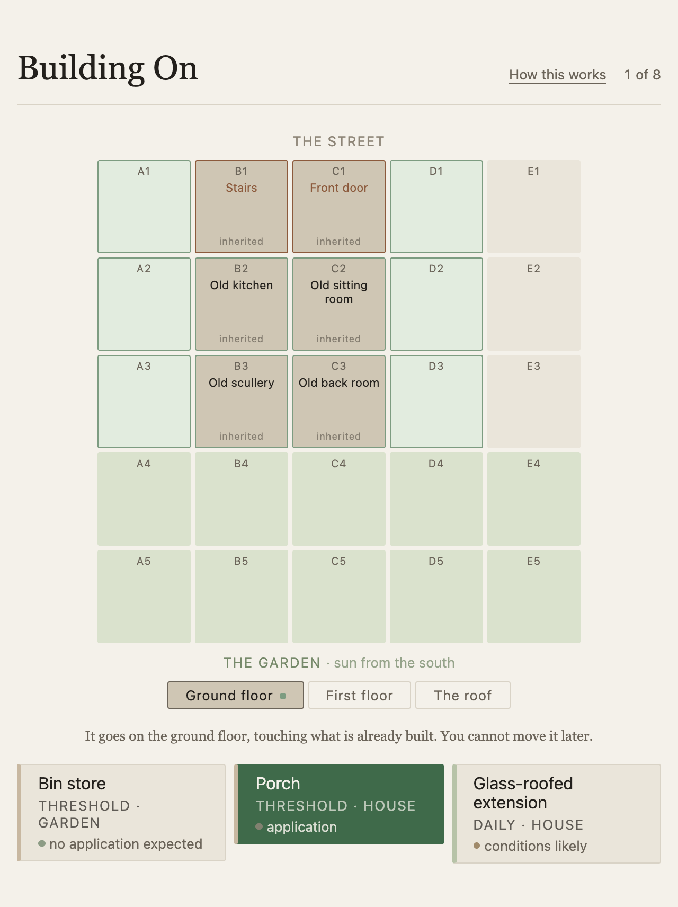
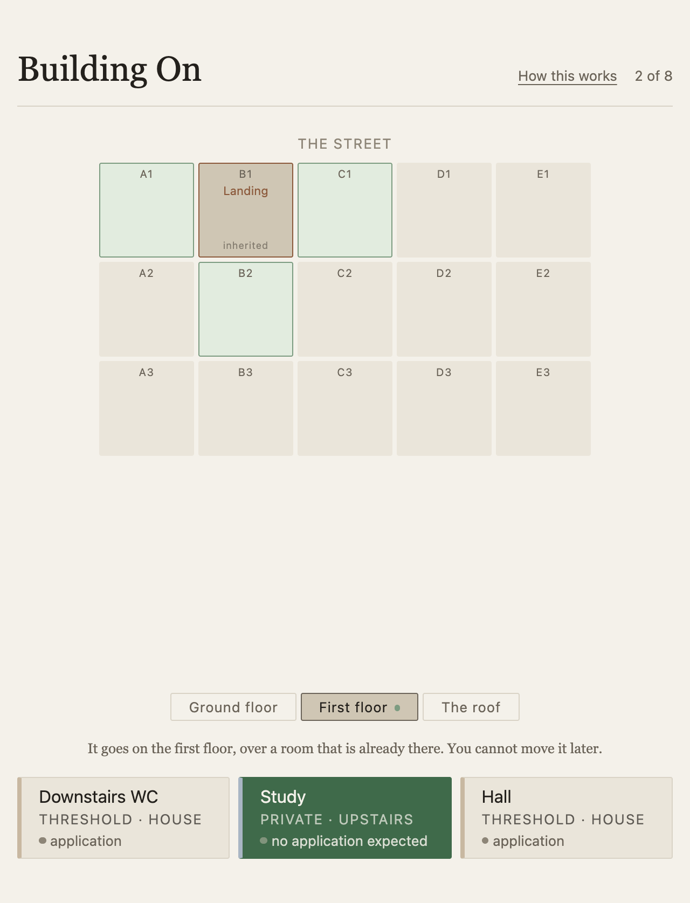
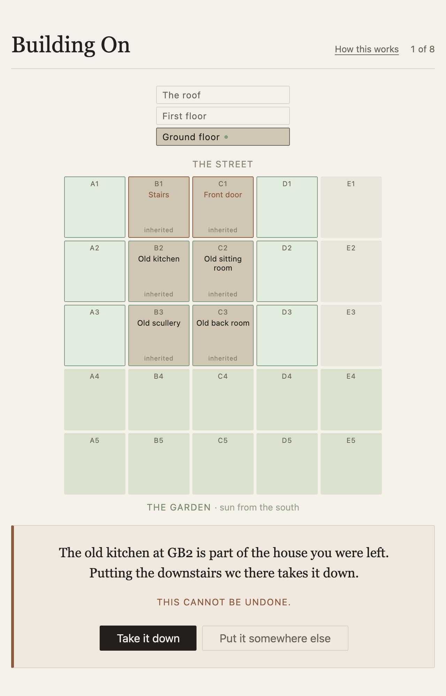
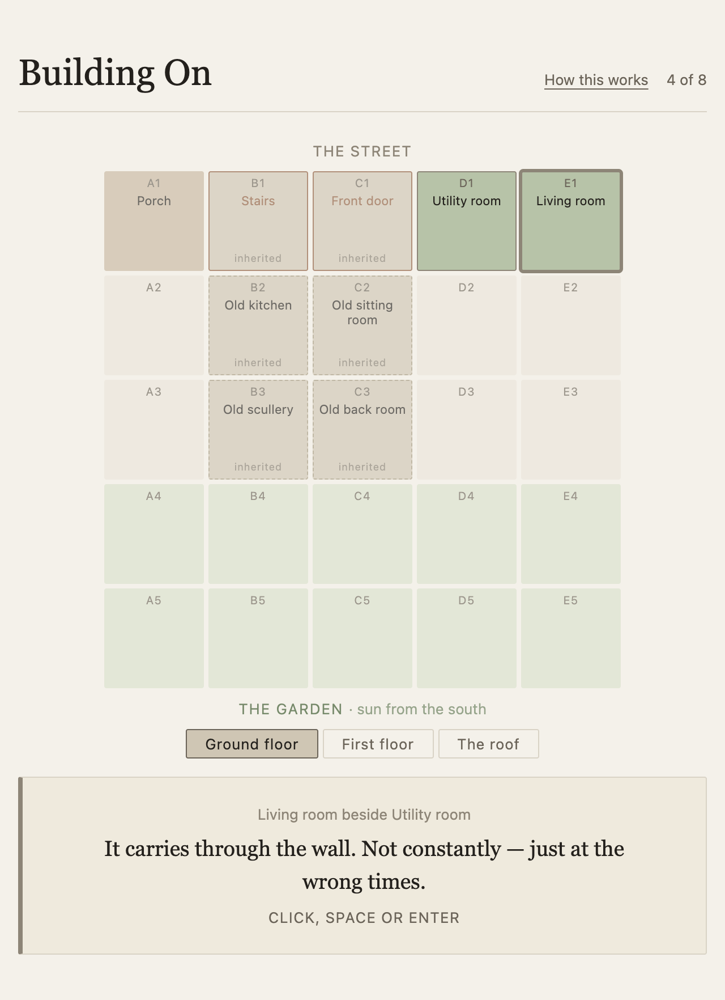
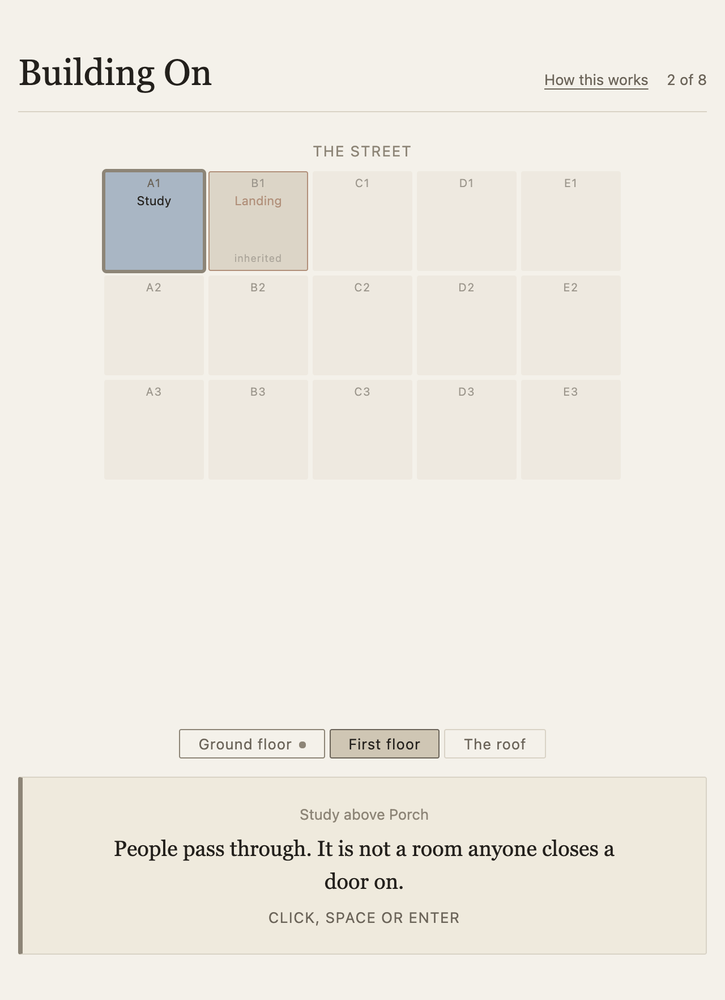
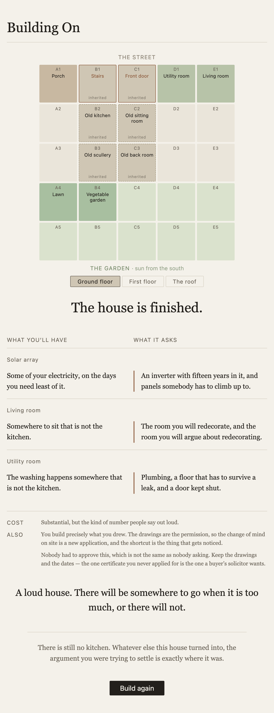

# How a game of Building On goes

A short walk through one game, from the situation you are given to the report at the end.
This describes what the game **does**, as built. [`GDD.md`](GDD.md) is the design
document — what it is for, and why — and [`PLAN.md`](PLAN.md) records how it got here.

**[Play it →](https://playablestories.github.io/building-on-game/)**

---

## The shape of it

You have inherited a house. Over eight rounds you are dealt plans and you place them on a
five-by-five plot, one per round, and you can never move one afterwards. The house
occasionally tells you what you have just put next to what. At the end it tells you what
you built and what it will ask of you for the rest of your life.

There is no score, no timer, no resource, and no way to lose.

---

## Before round one

**One situation.** Six are written; the game draws one from its seed and shows it with the
premise. *Two of you cook. One of you tidies. This has been the arrangement for years.* It
is the thing the house has to answer, and it is the last thing the report comes back to.

Six situations rather than three household members is a playtest fix. Three people with
names and ages were forgotten by round three; one situation you recognise is not.

**The rules**, in six lines, before you start — and reopenable at any point from *How this
works* in the header, because a rule you cannot look up is a rule you do not have.

---

## A round

### 1 · Three plans are dealt

Two come from the round's tier and one from anywhere left in the pool, then all three are
shuffled so the odd one is not always the card on the right.

| Rounds | Tier | Roughly |
|---|---|---|
| 1–2 | Threshold | Porch, boot room, downstairs WC — the way in |
| 3–4 | Daily | Kitchen, living room, utility — where the day happens |
| 5–6 | Private | Bedrooms, bathroom, study — the doors that close |
| 7–8 | Outside | Terrace, shed, vegetable garden, heat pump |

The free third card is what stops the game being on rails: it is how a heat pump or the
vegetable garden turns up in round two, where it is both tempting and awkward. Across 400
simulated games, 87% of hands hold something off-tier.

**The two you do not pick are not lost.** They go back in the pool and can be dealt again.
Only a plan you actually place leaves it — the game is 24 plans and you will build 8, so
most of the house is the house you did not build.

### 2 · You choose one, and the plot shows you where it can go

Selecting a plan lights the cells it is allowed to go in — and moves the board to the
level those cells are on, so you always arrive somewhere with highlights. Four rules
decide where a plan may go, and between them they are most of the game:

- **It has to touch.** A plan must be orthogonally adjacent to something already
  standing — a room you placed, or the old house. The house grows outward from itself; it
  cannot be built in scattered pieces. (A cell with an old room on it is the one
  exception: it is legal from the opening move, so demolition is never locked away behind
  building up to it.)
- **Every plan belongs somewhere.** The card says which: **in the house** (ground floor,
  rows 1–3), **in the garden** (rows 4–5), **upstairs**, or **on the roof**. No plan
  belongs in two places.
- **Upstairs only goes over a room.** A first-floor cell is legal only if the ground-floor
  cell directly beneath it holds something. What you build downstairs decides what you can
  sleep above — and the landing above the stair is standing from the start, which is what
  gives the first floor somewhere to begin.
- **The front door and the stairs are not yours to change.** GC1 and GB1 came with the
  house, are never legal cells, and cannot come down. They are the fixed points everything
  else is decided around.

**The roof is playable from the first round**, because the house you inherited already has
one — a rooflight over the old kitchen is a real application before you have built
anything. But **roofing a cell seals the first floor beneath it, permanently**. You roofed
it, so you cannot build up there now. It is the only irreversible move in the game besides
demolition, and the rules card says so.

Which row you land in matters, because rows face different ways — at every height. A
first-floor front bedroom faces the street exactly as the room under it does:

| Row | | What it is |
|---|---|---|
| 1 | faces north | The street elevation |
| 2 | — | The middle of the house |
| 3 | faces south | The back, onto the garden |
| 4 | faces north | Garden, in the shadow of the house |
| 5 | faces south | Open garden, full sun |

*A room is chosen, so the ground floor lights and the garden does not. The old rooms are lit
too — building on one is always allowed, and it takes it down.*

*Round 5, and every card in this hand goes upstairs. Choosing one takes the board up with it.
Only three cells are lit — the landing's neighbours that have a room underneath them. The rest
of the first floor has nothing to stand on yet, and the prompt says so.*

### 3 · You place it, and that is permanent

Placement lands on the click. There is no undo, no drag to reposition, no confirmation —
**except one.**

Four rooms of the old house are still standing: the old kitchen, the old sitting room, the
old scullery, the old back room. They are ordinary cells and you can build on them. Doing
so takes them down, for good, and that is the only thing the game asks you about before it
happens. Everything else in eight rounds is additive and forgiving; demolition is not,
because in building it is not.

They are named — *Old scullery*, not *Inherited* — for a reason found in playtesting. A
cell shouting **INHERITED** reads as scenery and nobody worked out it could be built on. A
cell that says *Old scullery* and murmurs *inherited* reads as a room, and rooms can go.

*It states what happens and gets out of the way. It does not warn and it does not argue —
the weight arrives on its own, because it is a house someone left you.*

### 4 · The house says one thing, or nothing

After a placement the game looks at the six cells around it — the four beside it, the one
directly under it and the one directly over it — and resolves **at most one line**, in a
strict order:

1. **An explicit pair** — a line written for this exact pairing. *Utility room beside
   living room.* More specific writing beats less: a line naming both plans beats one
   naming the old walls, which beats a wildcard.
2. **A quality match** — something one of them emits meeting something the other is
   sensitive to. Noise, smell, damp, cold. Both directions count. If several fire, the
   strongest wins.
3. **Orientation** — nothing next door, but the row it landed in faces somewhere.
4. **Nothing.** Silence is a valid result and is not a failure.

The line names its cause above it and lights both cells while you read it — *Utility room
beside Living room* over *"It carries through the wall. Not constantly — just at the wrong
times."* That is also a playtest fix: without it the sentence landed as atmosphere rather
than as a consequence of the move just made. Row 2 faces nothing at all, and no plan has a
line written for every direction — which is what keeps the game from having a remark about
every single placement.

*The living room has just gone in beside the utility room. Both are lit, everything else is
dimmed, and the cause is printed above the line it caused.*

**A line can be about two levels at once.** Put a study over the porch and the house says
so — *Study above Porch*, and the ceiling is doing what a wall does. The board goes to the
level of the thing you just placed, which is where the sentence starts, and the level
switcher marks the floor the rest of it is on so you can go and look without losing the
line. A pair line only speaks vertically if it was written to: everything written for two
rooms sharing a wall stays about walls.

*The study has just gone in over the porch. The line says* above*, not* beside*, and the
dot on **Ground floor** is where the other half of the sentence is standing.*

You dismiss the line to continue. If there is nothing to say, the round simply advances —
which is what happens slightly more than half the time.

---

## Consent, which is not permission

Every plan carries a flag, shown on the card before you choose it:

| Flag | Means |
|---|---|
| `no application` | Permitted development. Nobody has to be asked. |
| `application` | A householder application. |
| `conditions likely` | Sensitive — expect it to come back with conditions. |
| `demolition` | Something came down. |

These are **flags, not outcomes**. Nothing is ever refused, nothing is a warning, and no
placement is blocked by one. They are a record of process — what you took on by building
this rather than that — and they surface again in the report.

The flag on the card is the plan's own, because that is all that is knowable before it
lands. The real flag depends on where it goes: the same plan on the street and in the
garden are not the same application.

There is a **conservation area** dial in `content.ts` (`config.conservation`, off by
default). Turn it on and the same house becomes a heavier one: demolition asks more of you
afterwards, new openings in the street elevation pick up conditions, and named plans get
their own answer to give.

---

## The report

Eight rounds placed, and the game stops asking you things.

**Three rooms, benefit beside obligation.** Not all eight — the three that ask the most of
you, ranked by what they cost plus the heaviest consent flag they took on, ties going to
whatever you built later. Each one prints what you will have next to what it will want,
and the layout never lets you read one without the other. On a narrow screen they stack,
obligation directly under its benefit.

**One cost line**, as a phrase rather than a number. *The kind of project you remortgage
for.* No figure is ever shown, and nothing is totalled at any point during play.

**At most two obligations**, heaviest first — what the whole house has taken on rather
than what any one room did. Three householder applications are one ongoing relationship
with the local authority, not three, so they are deduplicated before anything is cut.

**A closing line** about the house as a whole, and then **the situation, answered**. The
one you were given at the start, and only that one. Sometimes the answer is that you did
not answer it: *There is still no kitchen. Whatever else this house turned into, the
argument you were trying to settle is exactly where it was.*

Three pairs and two obligations is deliberate and it is a cut. The earlier version printed
everything, and the playtest was blunt: *"the result is too complicate and too long."* A
payoff nobody reads to the end is not a payoff.

---

## What is deliberately not here

- **No score.** Nothing is counted, ranked or graded, at the end or during.
- **No failure.** There is no unplaceable hand, no dead end, and no wrong house.
- **No undo.** Eight decisions, each of them final. This is the whole point.
- **No totals during play.** The first quantity of any kind you see is the report — you
  are meant to be building a house, not optimising a column.

---

## Where this lives in the code

Useful if you want to change any of it. [`FORKING.md`](FORKING.md) is the full guide; the
short version is that everything above is either content or one small engine module.

| What | Where |
|---|---|
| Every word, the deck, the plot, the situations, the rules card | `src/content.ts` |
| Every colour, size and font | `src/theme.css` |
| The round count and the conservation dial | `config` in `src/content.ts` |
| The deal and the tier schedule | `src/engine/deck.ts` |
| Legal cells, levels, rows and what they face | `src/engine/grid.ts` |
| Which line fires, and why | `src/engine/adjacency.ts` |
| Flags and obligations | `src/engine/consent.ts` |
| What the report picks, and how it ranks it | `src/engine/report.ts` |
| The round itself | `src/engine/game.ts` |

Nothing in `src/engine/` imports `content.ts` — content is handed to it. That is what
makes swapping the building for a different one a content change rather than a rewrite,
and `npm run validate` fails if it stops being true.

---

## About the screenshots

They are generated, not captured by hand. `npm run screenshots` builds the game, plays a
real one in Chrome and rewrites all five, so they cannot drift from what the game does.

Two of them need something particular to happen rather than just a round to pass — the
demolition question, and a line that reads one room against another rather than an
orientation line, since only a pair lights two cells. The deck is dealt from a random
seed, so the script replays whole games until it is dealt one that offers every frame,
rather than steering the deck. Every frame above is therefore a game you could be dealt.
